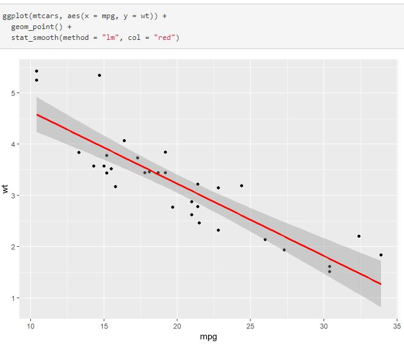

# Modelling with R

This repository has some materials and my practice about modelling with R.

**1. Introduction to broom** _(summary, in .rmd and html formats)_. [The initial source](https://cran.r-project.org/web/packages/broom/vignettes/broom.html)

